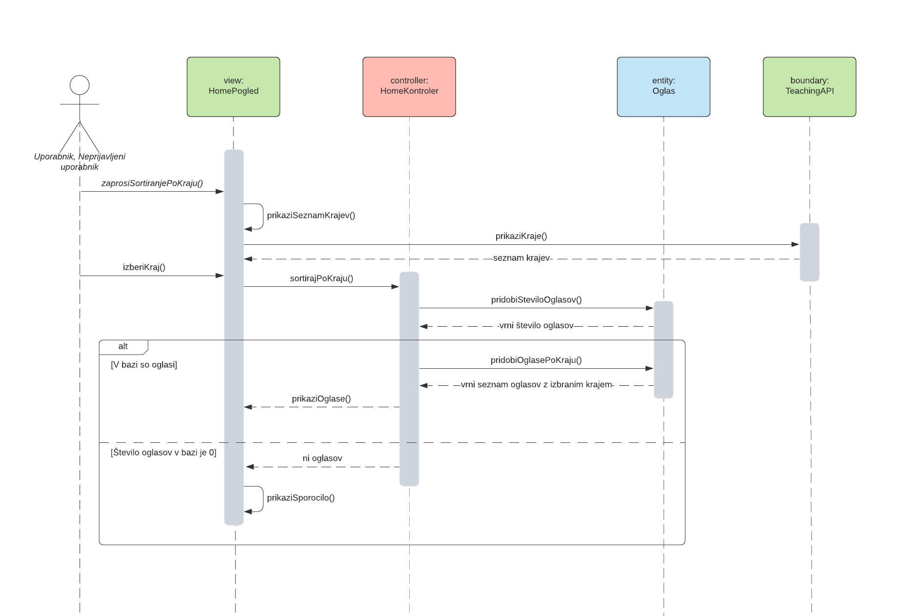
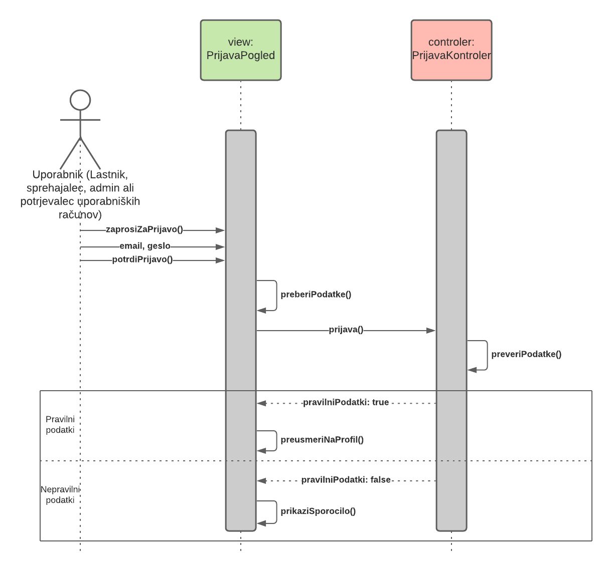

# Načrt sistema

|                             |                                                                        |
| :-------------------------- | :--------------------------------------------------------------------- |
| **Naziv projekta**          | Dog Walkers                                                            |
| **Člani projektne skupine** | Simon Babnik, Gašper Groznik, Gjorgji Jovanov, Sanil Safić, Anja Vihar |
| **Kraj in datum**           | Ljubljana, 19. 4. 2021                                                 |

## Povzetek

V dokumentu je opisan podroben načrt sistema, ki je organiziran v tri razdelke. V prvem je *načrt arhitekture* sistema, ki je prikazan z diagramoma, ki prikazujeta logični in razvojni pogled na arhitekturo. Drugi razdelek je *načrt strukture*, kjer sta opisana načrtovalska vzorca Template in Observer, ki smo ju v okviru načrtovanja uporabili. Sam načrt strukture je predstavljen z razrednim diagramom, temu pa sledijo opisi posameznih razredov, kjer so podrobnosti o njihovih atributih in metodah. V zadnjem razdelku je prikazan še *načrt obnašanja*, katerega osnova je diagram primerov uporabe iz dokumenta zajema zahtev. Za vsak primer uporabe so izdelani diagrami zaporedja, ki prikazujejo osnovne, alternativne in izjemne tokove dogodkov.

## 1. Načrt arhitekture

Za arhitekturo sistema je uporabljen vzorec model-pogled-krmilnik (MVC).

##### 1.1 Logični pogled

##### 1.2 Razvojni pogled

## 2. Načrt strukture

Pri načrtovanju strukture smo uporabili naslednja načrtovalska vzorca:
- Vzorec [Template](https://refactoring.guru/design-patterns/template-method) je genaraliziran v razred Gost. S tem načrtovalskem vzorcem rešujemo problem večih uporabniških vlog v spletni aplikaciji.
- Vzorec [Observer](https://refactoring.guru/design-patterns/observer) je uporabljen pri implementaciji chat serverja. S tem načrtovalskim vzorcem rešujemo problematiko povezovanja na integrirani klepet.

### 2.1 Razredni diagram

### 2.2 Opis razredov

### 2.2.1 Entitetni razredi

#### Ime razreda: Neprijavljeni uporabnik

Z razredom Neprijavljeni uporabnik predstavimo uporabnika, ki se še ni registriral na strani.

#### Atributi

Razred nima atributov.

#### Nesamoumevne metode

Razred nima nesamoumevnih metod.

------

#### Ime razreda: Sporočilo

Z razredom Sporočilo predstavimo sporočilo med uporabnikoma.

#### Atributi

| Ime atributa    | Podatkovni tip | Zaloga vrednosti | Pomen          |
| :-------------- | :------------- | :--------------- | :------------- |
| id              |      int       |        -         | identifikacija |
| id pošiljatelja |      int       |        -         | identifikacija |
| id prejemnika   |      int       |        -         | identifikacija |
| vsebina         |    string      |  max 200 znakov  |        -       |
| datum in čas    |  date & hour   |        -         |        -       |

#### Nesamoumevne metode

| Ime metode         | Imena in tipi parametrov                       | Tip rezultata | Pomen                     |
| :----------------- | :--------------------------------------------- | :------------ | :------------------------ |
| prikaziSporocilo() | int id, int id_pošiljatelja, int id_prejemnika | String        | Prikaže željeno sporočilo |
| izbrisiSporocilo() | int id, int id_pošiljatelja, int id_prejemnika | void          | Izbriše željeno sporočilo |
| posljiSporocilo()  | int id_prejemnika, String vsebina              | void          | Pošlje sporočilo          |

---------

#### Ime razreda: Pes

Z razredom Pes predstavimo uporabnikov psov.

#### Atributi 

| Ime atributa    | Podatkovni tip | Zaloga vrednosti | Pomen          |
| :-------------- | :------------- | :--------------- | :------------- |
| id              |     Integer    |        -         | identifikacija |
| ime             |     String     |   ^[a-zA-Z]+$    |       -        |
| pasma           |     String     |   ^[a-zA-Z]+$    |       -        |
| opis            |     String     |   ^[a-zA-Z]+$    |       -        |
| slika           |     String     | ^[A-Za-z0-9._%±] |       -        |

#### Nesamoumevne metode

| Ime metode                 | Imena in tipi parametrov    | Tip rezultata     | Pomen                                   |
| :------------------------- | :-------------------------- | :---------------- | :-------------------------------------- |
| pridobiPesZId()            |  Integer id_pes             |  Pes              |  Pridobi psa z določen id               |
| pridobiPse()              |  -                          |  ArrayList\<Pes\> |  Pridobi vseh psov                      |
| pridobiUporabnikovePsov    |  Integer id_uporabnika      |  ArrayList\<Pes\> |  Pridobi vseh psov za določen uporabnik |
| urediPesZId()              |  Integer id_pes             |  Pes              |  Pridobi pes za urejanje                |
| kreirajPes()               |  Pes pes                    |  void             |  Kreira pes z specifikacijami           |
| pobrisiPesZId()            |  Integer id_pes             |  void             |  Pobrise pes z določen id               |

--------

#### Ime razreda: Admin

Z razredom Admin predstavimo uporabnika admin, ki so mu omogočene vse funkcionalnosti aplikacije.

#### Atributi 

| Ime atributa  | Podatkovni tip | Zaloga vrednosti                                            | Pomen          |
| :------------ | :------------- | :---------------------------------------------------------- | :------------- |
| id            | Integer        | -                                                           | identifikacija |
| ime           | String         | -                                                           | -              |
| priimek       | String         | -                                                           | -              |
| email         | String         | ^[A-Za-z0-9._%+-]+@[A-Za-z0-9.-]+.[A-Za-z]{2,4}$            | -              |
| geslo         | String         | ^(?=.\*[a-z])(?=.\*[A-Z])(?=.\*[0-9])(?=.\*[!@#$%^&*])(?=.{8,}) | -              |
| slika profila | String         | ^[A-Za-z0-9._%±]                                            | -              |

#### Nesamoumevne metode

| Ime metode              | Imena in tipi parametrov | Tip rezultata    | Pomen                                         |
| :---------------------- | :----------------------- | :--------------- | :-------------------------------------------- |
| ustvariAdmina()         | Admin admin              | void             | Ustvari uporabniški račun z admin privilegiji |
| pridobiAdmina()         | Integer id_uporabnika    | Admin            | Pridobi admina z določenim id |
| pridobiVseAdmine()      | -                        | ArrayList\<Admin> | Pridobi seznam vseh adminov |
| urediAdmina() | Integer id_uporabnika | Admin | Pridobi admina z določenim id in njegove podatke, ki jih lahko urejamo |
| izbrisiAdmina() | Integer id_uporabnika | void | Izbriše admina z določenim id |
| jeAdmin() | Integer id_uporabnika | boolean | Preveri, če je uporabnik s podanim id admin |

---------

#### Ime razreda: Potrjevalec

Z razredom Potrjevalec predstavimo uporabnika potrjevalec profilov, ki v aplikaciji potrjuje profile novih uporabnikov.

#### Atributi 

| Ime atributa  | Podatkovni tip | Zaloga vrednosti                                            | Pomen          |
| :------------ | :------------- | :---------------------------------------------------------- | :------------- |
| id            | Integer        | -                                                           | identifikacija |
| ime           | String         | -                                                           | -              |
| priimek       | String         | -                                                           | -              |
| email         | String         | ^[A-Za-z0-9._%+-]+@[A-Za-z0-9.-]+.[A-Za-z]{2,4}$            | -              |
| geslo         | String         | ^(?=.\*[a-z])(?=.\*[A-Z])(?=.\*[0-9])(?=.\*[!@#$%^&*])(?=.{8,}) | -              |
| slika profila | String         | ^[A-Za-z0-9._%±]                                            | -              |

#### Nesamoumevne metode

| Ime metode              | Imena in tipi parametrov | Tip rezultata           | Pomen                                                        |
| :---------------------- | :----------------------- | :---------------------- | :----------------------------------------------------------- |
| ustvariPotrjevalca()    | Potrjevalec potrjevalec  | void                    | Ustvari uporabniški račun z vlogo potrjevalca                |
| pridobiPotrjevalca()    | Integer id_uporabnika    | Potrjevalec             | Pridobi potrjevalca z določenim id                           |
| pridobiVsePotrjevalce() | -                        | ArrayList\<Potrjevalec> | Pridobi seznam vseh potrjevalcev                             |
| urediPotrjevalca()      | Integer id_uporabnika    | Potrjevalec             | Pridobi potrjevalca z določenim id in njegove podatke, ki jih lahko urejamo |
| izbrisiPotrjevalca()    | Integer id_uporabnika    | void                    | Izbriše potrjevalca z določenim id                           |
| jePotrjevalec()         | Integer id_uporabnika    | boolean                 | Preveri, če je uporabnik s podanim id potrjevalec            |

-----

#### Ime razreda: Lastnik

Z razredom Lastnik predstavimo uporabnika lastnik psov, ki v aplikaciji išče primernega sprehajalca psov za njegovega psa.

#### Atributi 

| Ime atributa  | Podatkovni tip | Zaloga vrednosti                                            | Pomen                           |
| :------------ | :------------- | :---------------------------------------------------------- | :------------------------------ |
| id            | Integer        | -                                                           | identifikacija                  |
| id_psa        | Integer        | -                                                           | identifikacija lastnikovega psa |
| ime           | String         | -                                                           | -                               |
| priimek       | String         | -                                                           | -                               |
| email         | String         | ^[A-Za-z0-9._%+-]+@[A-Za-z0-9.-]+.[A-Za-z]{2,4}$            | -                               |
| geslo         | String         | ^(?=.\*[a-z])(?=.\*[A-Z])(?=.\*[0-9])(?=.\*[!@#$%^&*])(?=.{8,}) | -                               |
| slika profila | String         | ^[A-Za-z0-9._%±]                                            | -                               |

#### Nesamoumevne metode

| Ime metode           | Imena in tipi parametrov | Tip rezultata       | Pomen                                                        |
| :------------------- | :----------------------- | :------------------ | :----------------------------------------------------------- |
| ustvariLastnika()    | Lastnik lastnik          | void                | Ustvari uporabniški račun z vlogo lastnika                   |
| pridobiLastnika()    | Integer id_uporabnika    | Lastnik             | Pridobi lastnika z določenim id                              |
| pridobiVseLastnike() | -                        | ArrayList\<Lastnik> | Pridobi seznam vseh lastnikov                                |
| urediLastnika()      | Integer id_uporabnika    | Lastnik             | Pridobi lastnika z določenim id in njegove podatke, ki jih lahko urejamo |
| izbrisiLastnika()    | Integer id_uporabnika    | void                | Izbriše lastnika z določenim id                              |
| jeLastnik()          | Integer id_uporabnika    | boolean             | Preveri, če je uporabnik s podanim id lastnik                |

---------

#### Ime razreda: Oglas

Z razredom Oglas predstavimo oglase uporabnikov..

#### Atributi 

| Ime atributa    | Podatkovni tip | Zaloga vrednosti | Pomen          |
| :-------------- | :------------- | :--------------- | :------------- |
| id              |     Integer    |        -         | identifikacija |
| id_uporabnika   |     Integer    |        -         |       -        |
| naziv           |     String     |   ^[a-zA-Z]+$    |       -        |
| cena            |     Double    |        -         |       -        |
| kraj            |     String     |   ^[a-zA-Z]+$    |       -        |
| opis            |     String     | ^[A-Za-z0-9._%±] |       -        |

#### Nesamoumevne metode

| Ime metode                 | Imena in tipi parametrov    | Tip rezultata      | Pomen                                   |
| :------------------------- | :-------------------------- | :----------------  |  :--------------------------------------|
| pridobiOglasZId()          |  Integer id_oglas           |  Oglas             |  Pridobi oglas z določenim id-jem       |
| pridobiOglase()            |  -                          |  ArrayList\<Oglas\>|  Pridobi vse oglase                     |
| pridobiUporabnikoveOglase  |  Integer id_uporabnika      |  ArrayList\<Oglas\>|  Pridobi vse oglase uporabnika          |
| urediOglasZId()            |  Integer id_oglas           |  void              |  Uredi izbrani oglas                    |
| ustvariOglas()             |  Oglas oglas                |  void              |  Ustvari oglas                          |
| pobrisiOglasZId()          |  Integer id_oglas           |  void              |  Pobrise izbrani oglas                  |
| pobrisiOglaseSKrajem()     |  String kraj                |  ArrayList\<Oglas\>|  Pridobi oglase z izbranim krajem       |
| pobrisiOglaseZOceno()      |  boolean smer               |  ArrayList\<Oglas\>|  Pridobi oglase razvrščene glede na smer|

---
### 2.2.2 Mejni razredi

### Ime razreda: PotrjevanjeView

Z razredom PotrjevanjeView predstavimo pogled, ki ga bo uporabljal potrjevalec uporabnikov.

#### Atributi

Ta razred nima atributov.

#### Nesamoumevne metode

| Ime metode                    | Imena in tipi parametrov | Tip rezultata | Pomen  |
| :---------------------------- | :----------------------- | :------------ | :----- |
| prikaziNepotrjeneUporabnike() |             -            |     Object    |    -   |

---

### Ime razreda: AdminModulView

Z razredom AdminModulView predstavimo pogled, ki ga bo uporabljal administrator za urejanje ali brisanje uporabnike.

#### Atributi

Ta razred nima atributov.

#### Nesamoumevne metode

| Ime metode                    | Imena in tipi parametrov | Tip rezultata         | Pomen  |
| :---------------------------- | :----------------------- | :-------------------- | :----- |
| prikaziUporabnike()           |             -            | Arraylist\<Uporabnik\>|    -   |

---

### Ime razreda: ProfilView

Z razredom ProfilView predstavimo pogled, ki ga bo uporabljal vsak uporabnik za urejanje svoje podatke.

#### Atributi

Ta razred nima atributov.

#### Nesamoumevne metode

| Ime metode                   | Imena in tipi parametrov | Tip rezultata         | Pomen  |
| :--------------------------- | :----------------------- | :-------------------- | :----- |
| prikazeUporabnikovePodatke() | Integer id_uporabnik     | Uporabnik             |    -   |

---

### Ime razreda: SporocilaView

Z razredom SporocilaView predstavimo pogled, ki bo predstavljen v okviru integriranega klepeta v spletni aplikaciji.

#### Atributi
| Ime atributa      | Podatkovni tip | Zaloga vrednosti | Pomen          |
| :---------------- | :------------- | :--------------- | :------------- |
| id pošiljatelja   |       int      |        -         | identifikacija |
| id prejemnika     |       int      |        -         | identifikacija |

#### Nesamoumevne metode

| Ime metode          | Imena in tipi parametrov             | Tip rezultata | Pomen  |
| :------------------ | :----------------------------------- | :------------ | :----- |
| prikaziSporocila()  | int id_posiljatelj, int id_prejemnik |     Object    |    -   |

---

### Ime razreda: HomeView

Z razredom HomeView predstavimo pogled, ki vsebuje prikaz oglasov sprehajalcev psov in je dostopen vsem uporabniškim vlogam.

#### Atributi

Ta razred nima atributov.

#### Nesamoumevne metode

| Ime metode                 | Imena in tipi parametrov   | Tip rezultata         | Pomen                                     |
| :------------------------- | :------------------------- | :-------------------- | :---------------------------------------- |
| zaprosiSortiranjePoKraju() | -                          | void                  | Začne s postopkom sortiranja po kraju.    |
| prikaziSeznamKrajev()      | -                          | void                  |    -                                      |
| izberiKraj()               | -                          | void                  | Uporabnik izbere kraj, metoda prebere izbiro in pošlje podatke kontrolerju. |
| zaprosiSortiranjePoOceni() | -                          | void                  | Začne s postopkom sortiranja po oceni.    |
| prikaziSporocilo()         | String sporocilo           | void                  | Prikaže sporočilo o uspešnosti poizvedbe. |
| prikaziOglase()            | Arraylist\<Oglas\> oglasi  | void                  | -                                         |
| zaprosiUrejanjeOglasa()    | Integer id_oglas           | void                  | Prikaže obrazec za urejanje oglasa.       |
| potrdiUrejanjeOglasa()     | -                          | void                  | Začne s postopkom pošiljanja urejenih podatkov. |
| zapriUrejanje()            | -                          | void                  | -                                         |

---

### Ime razreda: PrijavaView

Z razredom PrijavaView predstavimo pogled, ki omogoča prijavo obstoječim uporabnikom.

#### Atributi

Ta razred nima atributov.

#### Nesamoumevne metode

| Ime metode          | Imena in tipi parametrov | Tip rezultata         | Pomen                                                |
| :------------------ | :----------------------- | :-------------------- | :--------------------------------------------------- |
| prikaziSporocilo()  | String sporocilo         | void                  | Prikaže sporočilo o uspešnosti poizvedbe.            |

---

### Ime razreda: RegistracijaView

Z razredom RegistracijaView predstavimo pogled, ki omogoča registracijo neprijavljenim uporabnikom.

#### Atributi

Ta razred nima atributov.

#### Nesamoumevne metode

| Ime metode           | Imena in tipi parametrov | Tip rezultata | Pomen                                                        |
| :------------------- | :----------------------- | :------------ | :----------------------------------------------------------- |
| prikaziVnosnaPolja() | -                        | void          | Prikaže vnosna polja, ki jih mora uporabnik izpolniti za registracijo. |
| prikaziSporocilo()   | String sporocilo         | void          | Prikaže sporočilo o napaki oziroma uspešni izvedbi.          |

---

### Ime razreda: OglasView

Z razredom OglasView predstavimo pogled, ki omogoča prikaz podrobnosti posameznega oglasa.

#### Atributi

| Ime atributa | Podatkovni tip | Zaloga vrednosti | Pomen                             |
| :----------- | :------------- | :--------------- | :-------------------------------- |
| id_oglas     | int            | -                | Identifikacija posameznega oglasa |

#### Nesamoumevne metode

| Ime metode                 | Imena in tipi parametrov | Tip rezultata | Pomen |
| :------------------------- | :----------------------- | :------------ | :---- |
| prikaziPodrobnostiOglasa() | int id_oglas             | void          | -     |

---

### 2.2.3 Kontrolni razredi

### Ime razreda: HomeController

Z razredom HomeController predstavimo kontroler, ki bo odgovoren za pogled HomeView.

#### Atributi

Ta razred nima atributov.

#### Nesamoumevne metode

| Ime metode          | Imena in tipi parametrov  | Tip rezultata             | Pomen                          |
| :------------------ | :------------------------ | :------------------------ | :----------------------------- |
| sortiranjePoKraju() | String kraj               | Arraylist\<Oglas\> oglasi | vrne oglase z ustreznim krajem |
| sortiranjePoOceni() | int ocena                 | Arraylist\<Oglas\> oglasi | vrne oglase z ustreznno oceno  |
| prikaziOglase()     |            -              | Arraylist\<Oglas\> oglasi | vrne vse oglase                |
| urediOglas()        | int id_oglasa, Oglas oglas| void                      | uredi oglas z id_oglas         |
| prikaziOglasZId()   | int id_oglasa             | Oglas oglas               | vrne oglas z id id_oglas       |

### Ime razreda: PrijavaController

Z razredom PrijavaController predstavimo kontroler, ki bo odgovoren za pogled PrijavaView.

#### Atributi

Ta razred nima atributov.

#### Nesamoumevne metode

| Ime metode          | Imena in tipi parametrov             | Tip rezultata             | Pomen                          |
| :------------------ | :----------------------------------- | :------------------------ | :----------------------------- |
| prijavi()           | String uporabnisko ime, String geslo | void                      | uporabniku dodeli žeton        |
| validiraj()         | String uporabnisko ime, String geslo | Boolean                   | preveri pravilnost vnosnih polj |

### Ime razreda: RegistracijaController

Z razredom RegistracijaController predstavimo kontroler, ki bo odgovoren za pogled RegistracijaView.

#### Atributi

Ta razred nima atributov.

#### Nesamoumevne metode

| Ime metode          | Imena in tipi parametrov             | Tip rezultata             | Pomen                          |
| :------------------ | :----------------------------------- | :------------------------ | :----------------------------- |
| registriraj()       | Uporabnik uporabnik                  | void                      | registrira uporabnika          |
| validiraj()         | Uporabnik uporabnik                  | Boolean                   | preveri pravilnost vnosnih polj |

### Ime razreda: ProfilController

Z razredom ProfilController predstavimo kontroler, ki bo odgovoren za pogled ProfilView.

#### Atributi
| Ime atributa      | Podatkovni tip | Zaloga vrednosti | Pomen          |
| :---------------- | :------------- | :--------------- | :------------- |
| id_uporabnika     |       int      |        -         | identifikacija |

#### Nesamoumevne metode

| Ime metode          | Imena in tipi parametrov             | Tip rezultata             | Pomen                            |
| :------------------ | :----------------------------------- | :------------------------ | :------------------------------- |
| vrniUporabnikaZId() | int id_uporabnika                    | Uporabnik uporabnik       | vrne uporabnika z izbranim id-jem|
| urediProfil()       | Uporabnik uporabnik, int id_uporabnika | void |  -  |
| izbrisiProfil()      | int id_uporabnika | void |  -  |

### Ime razreda: SporocilaController

Z razredom SporocilaController predstavimo kontroler, ki bo odgovoren za pogled SporocilaView.

#### Atributi
| Ime atributa      | Podatkovni tip | Zaloga vrednosti | Pomen          |
| :---------------- | :------------- | :--------------- | :------------- |
| id_posiljatelja   |       int      |        -         | identifikacija |
| id_prejemnika     |       int      |        -         | identifikacija |

#### Nesamoumevne metode

| Ime metode          | Imena in tipi parametrov                                   | Tip rezultata             | Pomen                                          |
| :------------------ | :--------------------------------------------------------- | :------------------------ | :--------------------------------------------- |
| vrniSporocila()     | int id_posiljatelja, int id_prejemnika                     | ArrayList<Sporocilo>      | vrne sporocila med uporabnikom s podanimi id-ji|
| posljiSporocilo()   | int id_posiljatelja, int id_prejemnika, Sporocilo sporocilo| void                      | zapise sporocilo v bazo                        |
| izbrisiSporocilo()  | Sporocilo sporocilo                                        | void                      | zbriše sporocilo                               |

### Ime razreda: OcenjevanjeController

Z razredom OcenjevanjeController predstavimo kontroler, ki bo odgovoren za ocenjevanje psov in sprehajalcev.

#### Atributi

Ta razred nima atributov.

#### Nesamoumevne metode

| Ime metode          | Imena in tipi parametrov             | Tip rezultata             | Pomen                          |
| :------------------ | :----------------------------------- | :------------------------ | :----------------------------- |
| oceniSprehajalca()  | int id_sprehajalca, int ocena        | void                      | oceni sprehajalca              |
| oceniPsa()          | int id_psa, int ocena                | void                      | oceni psa                      |

### Ime razreda: PotrjevanjeController

Z razredom PotrjevanjeController predstavimo kontroler, ki bo odgovoren za pogled PotrjevanjeView.

#### Atributi

| Ime atributa    | Podatkovni tip | Zaloga vrednosti | Pomen          |
| :-------------- | :------------- | :--------------- | :------------- |
| id uporabnika   |       int      |        -         | identifikacija |

#### Nesamoumevne metode

| Ime metode          | Imena in tipi parametrov | Tip rezultata | Pomen  |
| :------------------ | :----------------------- | :------------ | :----- |
| potrdiUporabnika()  | int id_uporabnika        |      void     |    -   |
| zavrniUporabnika()  | int id_uporabnika        |      void     |    -   |

### Ime razreda: AdminController

Z razredom PotrjevanjeController predstavimo kontroler, ki bo odgovoren za pogled PotrjevanjeView.

#### Atributi

| Ime atributa    | Podatkovni tip | Zaloga vrednosti | Pomen           |
| :-------------- | :------------- | :--------------- | :-------------- |
| id_uporabnika   | Integer        |        -         | identifikacija  |
| id_oglas        | Integer        |        -         | identifikacija  |
| id_uporabnika   | Integer        |        -         | identifikacija  |
| id_uporabnika   | Integer        |        -         | identifikacija  |
| uporabnik       | Uporabnik      |        -         | razred Uporabnik|
| sporocilo       | Sporocilo      |        -         | razred Sporocilo|
#### Nesamoumevne metode

| Ime metode               | Imena in tipi parametrov  | Tip rezultata            | Pomen  |
| :----------------------- | :------------------------ | :----------------------- | :----- |
| urediOglas()             |  Integer id_oglas         |  void                    |   -    |
| zbrisiOglas()            |  Integer id_oglas         |  void                    |   -    |
| prikaziUporabnike()      |  -                        |  Arraylist\<Uporabnik\>  |   -    |
| urediUporabnikZId()      |  Integer id_uporabnik     |  Uporabnik               |   -    |
| zbrisiUporabnikZId()     |  Integer id_uporabnik     |  void                    |   -    |
| kreirajUporabnika()      |  Uporabnik uporabnik      |  void                    |   -    |
| potrdiUporabnika()       |  Integer id_uporabnik     |  void                    |   -    |
| zavrniUporabnika()       |  Integer id_uporabnik     |  void                    |   -    |
| posljiSporocilo()        |  Sporocilo sporocilo      |  void                    |   -    |

-----

### Ime razreda: PesController

Z razredom PesController predstavimo kontroler, ki je odgovoren za pogled pesView.

#### Atributi

Razred nima atributov.

#### Nesamoumevne metode

Razred nima nesamoumevnih metod.

---

### Ime razreda: OglasController

Z razredom OglasController predstavimo kontroler, ki bo odgovoren za pridobivanje podatkov o oglasih.

#### Atributi

| Ime atributa    | Podatkovni tip | Zaloga vrednosti | Pomen           |
| :-------------- | :------------- | :--------------- | :-------------- |
| id_oglas        | Integer        |        -         | identifikacija  |
| oglas           | Oglas          |        -         | razred Oglas    |

#### Nesamoumevne metode

| Ime metode          | Imena in tipi parametrov | Tip rezultata      | Pomen  |
| :------------------ | :----------------------- | :----------------- | :----- |
| preveriPodatke()    | Oglas oglas              | Boolean            |   -    |
| vrniOglase()        | -                        | ArrayList\<Oglas\> |   -    |
| vrniOglas()         | Integer id_oglas         | Oglas              |   -    |
| urediOglas()        | Integer id_oglas         | void               |   -    |
| zbrisiOglas()       | Integer id_oglas         | void               |   -    |

---

### 2.2.4 Zunanji razredi

### Ime razreda: LeafletAPI

Z razredom LeafletAPI predstavimo zunanji sistem, ki ga bomo uporabljali za prikaz lokacije s pomočjo koordinat.

#### Atributi

| Ime atributa    | Podatkovni tip | Zaloga vrednosti | Pomen          |
| :-------------- | :------------- | :--------------- | :------------- |
| latitude        |     double     |    -90 - +90     |        -       |
| longitude       |     double     |   -180 - +180    |        -       |

#### Nesamoumevne metode

| Ime metode          | Imena in tipi parametrov | Tip rezultata | Pomen  |
| :------------------ | :----------------------- | :------------ | :----- |
| prikaziLokacijo()   | double lat, double lng   |      void     |    -   |

### Ime razreda: TeachingLavbicAPI

Z razredom TeachingLavbicAPI predstavimo zunanji sistem, ki ga bomo uporabljali za prikaz Slovenskih krajev in pridobivanje koordinat krajev.

#### Atributi

| Ime atributa    | Podatkovni tip | Zaloga vrednosti | Pomen          |
| :-------------- | :------------- | :--------------- | :------------- |
| kraj            |     string     |         -        |        -       |

#### Nesamoumevne metode

| Ime metode          | Imena in tipi parametrov | Tip rezultata | Pomen  |
| :------------------ | :----------------------- | :------------ | :----- |
| prikaziKraje()      |            -             |     object    | Vrne seznam krajev |
| pridobiKoordinate() | string kraj              |     object    | Pridobi koordinate izbranega kraja |

### Ime razreda: TheDogAPI

Z razredom TheDogAPI predstavimo zunanji sistem, ki ga bomo uporabljali za prikaz podrobnosti o pasmah.

#### Atributi

| Ime atributa    | Podatkovni tip | Zaloga vrednosti | Pomen          |
| :-------------- | :------------- | :--------------- | :------------- |
| pasma           |     string     |         -        |        -       |

#### Nesamoumevne metode

| Ime metode           | Imena in tipi parametrov | Tip rezultata | Pomen  |
| :------------------- | :----------------------- | :------------ | :----- |
| pridobiPodrobnosti() | string pasma             |     object    | Vrne ime pasme, sliko, karakter in velikost pasme |

## 3. Načrt obnašanja

### Administratorski modul

---

### Potrjevanje uporabnikov

---

### Sortiranje po kraju

---

### Sortiranje po oceni

---

### Urejanje oglasa

---

### Urejanje profila

---

### Dodajanje psa

---

### Klepet

---

### Objava oglasa

---

### Ocenjevanje

---

### Prijava

---

### Registracija

---
