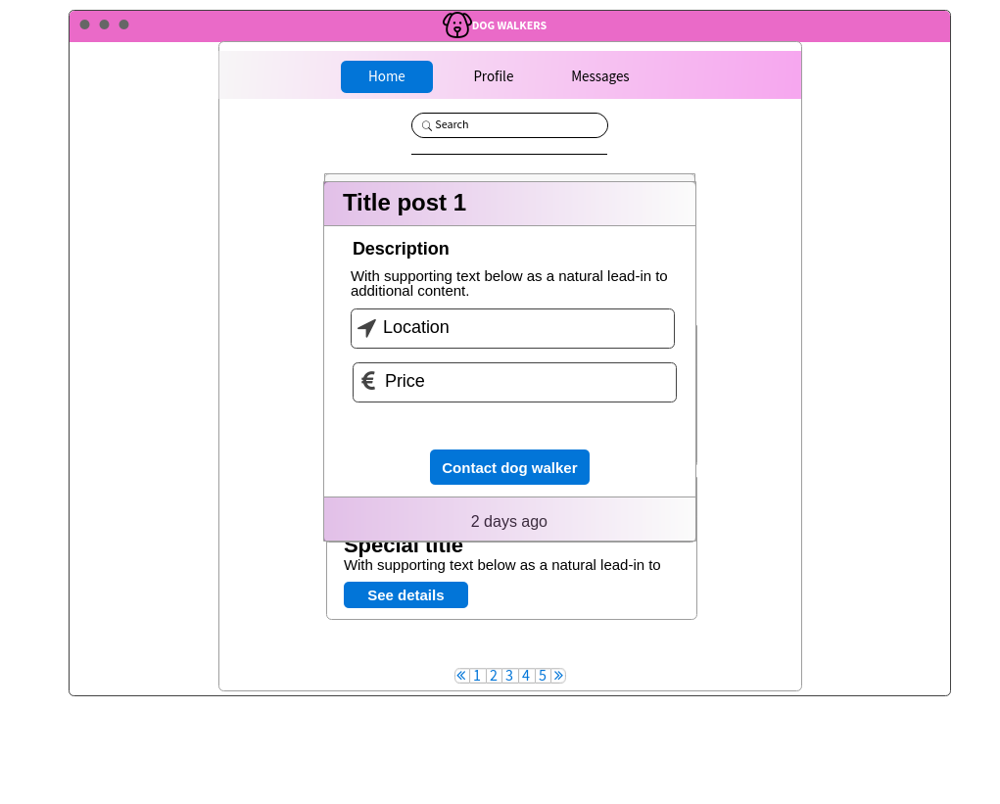
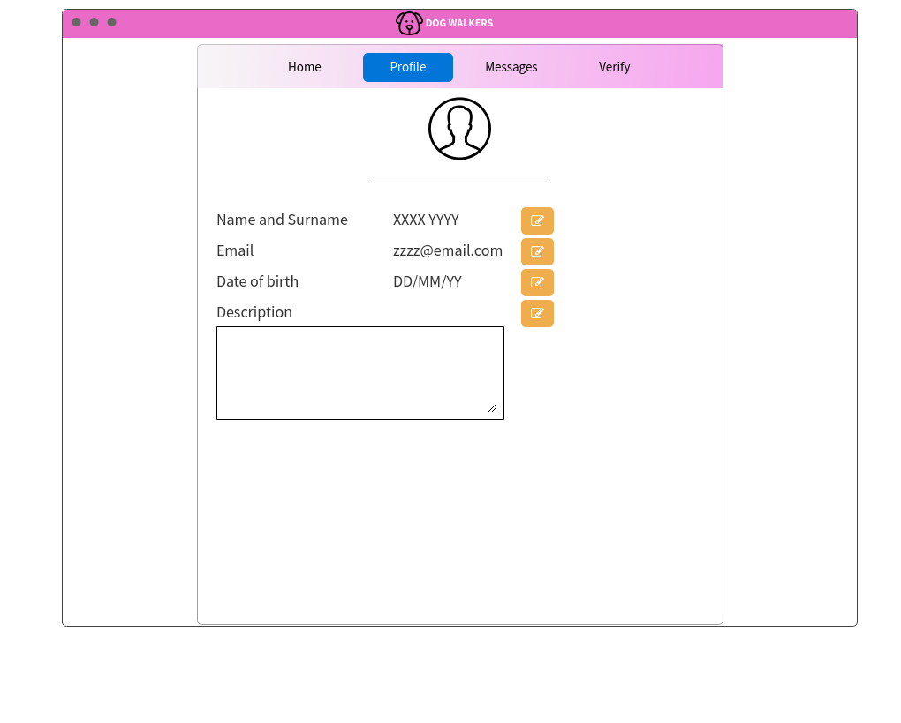

# Dokument zahtev

|                             |                                                                        |
| :-------------------------- | :--------------------------------------------------------------------- |
| **Naziv projekta**          | Dog Walkers                                                            |
| **Člani projektne skupine** | Simon Babnik, Gašper Groznik, Gjorgji Jovanov, Sanil Safić, Anja Vihar |
| **Kraj in datum**           | Ljubljana, 6. 4. 2021                                                  |

## Povzetek projekta

**Dog Walkers** je aplikacija, ki je namenjena ljubiteljem psov. Sprehajalci psov se registrirajo in objavijo oglas s svojo ponudbo. Te oglasi so namenjeni lastnikom psov, ki izberejo primernega sprehajalca in ga kontaktirajo. Aplikacija nudi tudi administratorski modul, kjer ima admin pregled nad vsemi uporabniki, prav tako pa lahko določi potrjevalca uporabnikov, ki pregleduje identitete novo registriranih uporabnikov. Uporabniške vloge so podrobneje opisane v sekciji *Uporabniške vloge*. Tem sledita *slovar pojmov* s têrmini, ki se uporabljajo v tem dokumentu in *diagram primerov uporabe*, ki predstavlja interakcijo med akterji in funkcionalnostmi. Vsaka *funkcionalna zahteva* je nato tudi podrobneje opisana, predstavljeni so osnovni tok in alternativni tokovi, pogoji, posledice, posebnosti, prioriteta in sprejemni testi. Sledijo *nefunkcionalne zahteve* z omejitvami pri razvoju aplikacije. Na koncu dokumenta se nahajajo *zaslonske maske* in predstavitev treh *vmesnikov zunanjih sistemov*, ki jih bo aplikacija uporabljala, prav tako je opisan vmesnik, ki ga bo aplikacija nudila drugim zunanjim sistemom.

## 1. Uvod

Skrb za domačo žival je velika odgovornost, ki zahteva čas in predanost. Veliko ljudi se zaradi tega ne odloči za posvojitev ali nakup domače živali, čeprav bi se radi ukvarjali in skrbeli za njih, a jim odsotnost od doma tega preprosto ne omogoča. V duhu današnjega časa epidemije vse večji delež ljudi dela od doma, kar predstavlja velik prihranek pri času, ki bi ga drugače porabili za potovanje na delovno mesto, prav tako pa lahko nadzirajo dogajanje doma. Posvojitev živali je torej kar naenkrat mogoča. Epidemija pa ne bo večna, življenje pa se bo ustalilo nazaj v stare tirnice in zaradi nezmožnosti nadaljnje skrbi za žival, bo le ta pristala nazaj v zavetišču. Problem pomanjkanja časa prej ali slej doleti tudi predane lastnike živali, ki se za pomoč za začasno oskrbo živali obrnejo na sorodnike ali prijatelje. Marsikdo te možnosti nima, v takih situacijah pa najbolj nastrada žival. Aplikacija Dog Walkers bo poskrbela, da bo do takih scenarijev prihajalo čim manj.

**Dog Walkers** je aplikacija, ki se osredotoča na ljubitelje psov. Lastniki psov, ki so v časovni stiski in zato ne morejo dobro poskrbeti za svoje pse, bodo lahko izbrali primernega sprehajalca psa, ki bo za določen čas skrbel za njihove živali. Sprehajalci psov pa se tako lahko v svojem prostem času ukvarjajo s psmi, brez da bi jih morali posvojiti, hkrati pa lahko tudi zaslužijo, če se odločijo za svoje storitve računati.

### Funkcionalnosti

V aplikaciji nastopa več uporabniških vlog, in sicer: lastnik psov, sprehajalec psov, potrjevalec uporabnikov, admin in neprijavljen uporabnik. Vsak uporabnik aplikacije lahko nastopa v vlogi neprijavljenega uporabnika. Neprijavljenemu uporabniku je dostopna domača strani z oglasi, ki jih lahko pregleduje in filtrira po krajih in ocenah sprehajalca. Če si želi ogledati podrobnosti oglasa, se mora prijaviti. Aplikacija omogoča registracijo novega uporabnika kot lastnika psov ali kot sprehajalca psov.

Prijavljenim uporabnikom (vse vloge razen neprijavljeni uporabnik) se ob kliku na prikaz podrobnosti oglasa odpre pojavno okno s podrobnostmi o oglasu, prav tako pa je prikazana možnost kontaktiranja sprehajalca. Vsak prijavljen uporabnik ima dostop do svojega profila, kjer si ga lahko ureja. Lastniki psov lahko v profilu dodajajo svoje pse, sprehajalci pa imajo možnost dodajanja oglasov na domači strani.

Preden lahko uporabnik, ki se je registriral kot lastnik psa, pošlje sprehajalcu sporočilo in s tem izkaže zanimanje za ponudbo, mora v svoj profil dodati vsaj enega psa in navesti njegove informacije, kot so ime psa, pasma in dodaten opis psa. Izbranemu sprehajalcu pošlje sporočilo s povpraševanjem po ponudbi, prav tako pa mora ob zahtevi za sprehod specificirati za katerega od njegovih psov se gre. Sprehajalec psov se po pregledu informacij o psu in pogovoru z lastnikom odloči, ali bo ponudbo sprejel ali zavrnil. Po opravljeni storitvi se lahko lastnik in sprehajalec medsebojno ocenita. Vsi prijavljeni uporabniki imajo možnost prijave zlorabe aplikacije s strani drugega uporabnika.

Ker je varnost in zaščita vseh udeležencev glede na naravo storitve pomembna, se zahteva verifikacijo ob registraciji uporabnikov z osebnim dokumentom. Verifikacijo opravlja potrjevalec uporabnikov, ki ima dostop do seznama novo registriranih uporabnikov. Po pregledu podatkov te uporabnike odobri ali pa jih zavrne. Pregled nad vsemi uporabniki je na voljo adminu, ki ima poseben administratorski modul, kjer lahko ureja uporabnikove informacije, določa uporabniške vloge in briše uporabniške račune.

### Nefunkcionalne zahteve

Aplikacija mora biti na voljo na javno dostopnem spletnem naslovu najmanj 96% časa, kar predstavlja približno 30 ur nenapovedanega izpada mesečno. Pričakuje se nemoteno delovanje vsaj do obremenitve 200 uporabnikov hkrati, kar pomeni, da mora sistem ob normalnem delovanju zagotavljati odzivni čas pod 3 sekunde. Aplikacija mora imeti določene varnostne elemente kot sta zaščita pred DDoS napadom in shranjevanje gesel v obliki zgoščenih vrednosti. Pričakuje se zanesljivost aplikacije, kar pomeni, da se morajo ob napaki pri pisanju v podatkovno bazo povezane spremembe povrniti. Zaradi zaupnosti podatkov imajo dostop do baz z vsemi podatki le admini, aplikacija pa mora biti prav tako v skladu z uredbo o varstvu osebnih podatkov GDPR, dodatno pa za zaposlene velja pogodba o nerazkritju informacij. Vsi uporabniki aplikacije morajo spoštovati zakon o zaščiti živali (ZZZiv). Implementacija aplikacije mora omogočati enostavno dodajanje novih funkcionalnosti, za upravljanje z izvorno kodo med razvojem pa se bo uporabljal sistem Git. 

### Zunanji sistemi

Za določene funkcionalnosti se aplikacija zanaša na zunanje sisteme, uporabljala bo tri. 
- **The Dog API** je vmesnik, ki omogoča pridobivanje informacij o pasmah psov. V aplikacijo bo integriran ob kliku na pasmo psa, ki bo radovednemu uporabniku prikazal podrobnosti o pasmi. 
- Za izbiro krajev in pridobivanje informacij o zemljepisni dolžini in širini bo uporabljen **Teaching API strežnik**.
- Za prikaz zemljevida in označbo lokacije oglasa se bo uporabljal vmesnik **Google Maps**, kar bo obogatilo vsebino aplikacije z vizualizacijo in tako nudilo prijetnejšo uporabniško izkušnjo.

Aplikacija bo prav tako nudila svoj lastni vmesnik drugim zunanjim sistemom. Zunanji sistemi bodo lahko pridobili javno dostopne podatke o oglasih sprehajalcev. Te podatke bodo lahko npr. uporabili za prikaz in promocijo oglasov, prikaz statistike glede na kraj oglasa ali ceno itd.

### Podatkovne baze

Za svoje delovanje bo aplikacija potrebovala dve podatkovni bazi. Ena od baz bo SQL podatkovna baza za shranjevanje šifriranih osebnih podatkov uporabnikov, medtem ko bo druga baza MongoDB, ki bo služila za shranjevanje vseh ostalih neobčutljivih podatkov.

## 2. Uporabniške vloge

**Sprehajalci psov**

Registrirani sprehajalci psov imajo dostop do vseh uporabniških funkcionalnosti v okviru aplikacije. Dostopajo do svojega profila, kjer lahko spreminjajo svoj opis in lastnosti. Objavljajo lahko oglase, kjer ponujajo sprehode za različne pasme psov.

**Lastniki psov**

Registrirani lastniki psov imajo dostop do vseh uporabniških funkcionalnosti v okviru aplikacije. V aplikaciji se jim ponudi primerne sprehajalce psov za njihovo pasmo. Med ponujenimi sprehajalci psov nato lahko izbirajo in pošljejo ponudbo. Če jih sprehajalec psov sprejme, se povežeta preko vgrajenega pogovornega sistema ali pa preko ostalih kanalov za komunikacijo.

**Admin**

Admin lahko dostopa do vseh funkcionalnosti aplikacije in do baz podatkov. Kot edini ima dostop do administrativnega modula, kjer ima na voljo seznam vseh uporabnikov. Iz seznama lahko uredi ali izbriše uporabnika.

**Potrjevalec uporabnikov**

Potrjevalec uporabnikov potrjuje uporabnike. Prav tako ima dostop do ogleda oglasov, ampak ji sam ne more objaviti. Ima tudi svoj lasten profil, kjer lahko ureja svoje osebne podatke. 

**Neprijavljeni uporabnik**

Neprijavljeni uporabnik lahko dostopa do seznama oglasov, ampak do podrobnosti posameznih oglasov nima dostopa. Prav tako ne more objavljati oglasov ali stopiti v kontakt s sprehajalcem psov. Dostopati ne more tudi do profila. Če želi dostopati do profila, se mora neprijavljen uporabnik najprej registrirati.

## 3. Slovar pojmov

- aplikacija - uporabniški računalniški program, ki ga razvijlci razvijejo zato, da uporabnikom programa zagotavlja določene uporabne lastnosti.
- registracija - vpis podatkov o novem uporabniku v evidenco uporabnikov.
- oglas - ponudba, ki jo sprehajalec psov vnese v aplikacijo za opravljanje storitve.
- admin - uporabnik, ki ima nadzor in možnost upravljanja drugih uporabniških računov. 
- akter - uporabnik, ki komunicira z našo aplikacijo.
- funkcionalnost - opisuje kako opisani del aplikacije deluje.
- filtriranje - prikazovanje izdelkov glede na iskane parametre.
- kontaktiranje - možnost sporočanja med sprehajalcem in lastnikom psov.
- verifikacija - potrjevanje uporabniškega raučuna s pomočjo uradnega dokumenta.
- sortiranje - prikazovanje izdelkov glede na iskane parametre.
- uporabniško ime - ime, ki ni nujno enako pravemu imenu osebe in se uprablja za identifikacijo znotraj apliakcije.
- GDPR -  kratica za General Data Protection Regulation oz. za Splošno uredbo EU o varstvu podatkov, ki določa nova pravila glede varstva osebnih podatkov.
- zakodiranje - pretvorba sporočila tako, da ga nepooblaščene osebe ne morejo razumeti.
- API - vmesnik za namensko programiranje ali aplikacijski programski vmesnik, angleško application programming interface, API) je množica rutin, protokolov in orodij za - - izgradnjo programske opreme in aplikacij.
- ZZZiv - zakon o zaščiti živali.
- NDA - pogodba o nerazkritju informacij.
- implementacija - dejanje, s katerim kaj zamišljenega, novega postane stvarnost.
- DDoS napad -  Distributed Denial of Service ali porazdeljena zavrnitev storitve
- zgoščena vrednost - vrednost, ki jo sestavlja geslo in naključno generirana vrednost, shranjena v bazi.
- home stran - domača stran

## 4. Diagram primerov uporabe

## 5. Funkcionalne zahteve

### Registracija

Neprijavljen uporabnik se lahko registrira v spletno aplikacijo, s čimer mu je kasneje omogočena prijava v aplikacijo.

#### Osnovni tok

1. Uporabnik izbere funkcionalnost *Registracija*
2. Aplikacija uporabniku prikaže obrazec z vsemi potrebnimi podatki, ki jih mora vnesti, da se lahko uspešno registrira:
   - elektronski naslov
   - ime
   - priimek
   - datum rojstva
   - geslo
   - potrditev gesla
   - slika osebne izkaznice
   - profilna slika
   - izbira tipa uporabniškega računa
3. Uporabnik vnese zahtevane podatke in potrdi njihov vnos
4. Aplikacija uporabnika obvesti o uspešni registraciji

#### **Alternativni tok**

1. Admin na administratorskem modulu izbere funkcionalnost *Registriraj uporabnika*
2. Aplikacija adminu prikaže obrazec z vsemi potrebnimi podatki, ki jih mora vnesti, da lahko uspešno registrira novega uporabnika:
   - elektronski naslov
   - ime
   - priimek
   - geslo
   - potrditev gesla
   - izbira uporabniške vloge (lastnik psov, sprehajalec psov, potrjevalec profilov, admin)
3. Admin vnese zahtevane podatke in potrdi njihov vnos
4. Aplikacija admina obvesti o uspešni registraciji novega uporabnika

#### Izjemni tokovi

- Uporabnik ne more uspešno zaključiti registracije, ker račun z njegovim uporabniškim imenom že obstaja
- Uporabnik ne more uspešno zaključiti registracije, ker račun z njegovim elektronskim naslovom že obstaja
- Uporabnik ne more uspešno zaključiti registracije, ker je vnesel neveljavne vrednosti v vnosna polja za registracijo

#### Pogoji

Do te funkcionalnosti lahko dostopa le neprijavljen uproabnik ali admin.

#### Posledice

Če se neprijavljen uporabnik uspešno registrira, s tem ustvari uporabniški račun, s katerim se lahko kasneje prijavi v aplikacijo in so mu omogočene funkcionalnosti lastnika psov ali sprehajalca psov (skladno z opcijo, ki jo je izbral pri registraciji).

#### Posebnosti

V primeru registracije se moramo držati varstva osebnih podatkov (GDPR), prav tako pa moramo prijavne podatke ustrezno šifrirati, saj gre za občutljive podatke.

#### Prioritete identificiranih funkcionalnosti

Must have

#### Sprejemni testi

| Primer uporabe | Funkcija, ki se testira                                      | Začetno stanje sistema                                       | Vhod                                                         | Pričakovan rezultat                                          |
| -------------- | ------------------------------------------------------------ | ------------------------------------------------------------ | ------------------------------------------------------------ | ------------------------------------------------------------ |
| Registracija   | Registracija novega uporabnika                               | Uporabnik še nima ustvarjenega uporabniškega računa v aplikaciji | Pravilno izpolnjeni podatki (elektronski naslov, ime, priimek, datum rojstva, geslo, potrditev gesla, slika osebne izkaznice) | Registracija se uspešno zaključi, v aplikaciji se ustvari nov uporabniški račun |
| Registracija   | Preverjanje pravilnosti podatkov vnosnih polj                | Uporabnik še nima ustvarjenega uporabniškega računa v aplikaciji | Prazen elektronski naslov, ostali podatki so pravilno izpolnjeni (ime, priimek, datum rojstva, geslo, potrditev gesla, slika osebne izkaznice) | Aplikacija obvesti uporabnika o manjkajočem elektronskem naslovu, registracija se ne zaključi uspešno. |
| Registracija   | Preverjanje ujemanja gesel                                   | Uporabnik še nima ustvarjenega uporabniškega računa v aplikaciji | Geslo in potrditev gesla se ne ujemata, ostali podatki so pravilno izpolnjeni (elektronski naslov, ime, priimek, datum rojstva, slika osebne izkaznice) | Aplikacija obvesti uporabnika o tem, da se geslo in potrditev gesla ne ujemata, registracija se ne zaključi uspešno. |
| Registracija   | Preverjanje, če račun s tem elektronskim naslovom že obstaja | Uporabnik ima že registriran uporabniški račun z elektronskim naslovom, ki ga je vnesel | Elektronski naslov ki je že bil uporabljen pri registraciji, ostali podatki so pravilno izpolnjeni (ime, priimek, datum rojstva, geslo, potrditev gesla, slika osebne izkaznice) | Aplikacija obvesti uporabnika o tem, da že obstaja uporabniški račun z enakim elektronskim naslovom, registracija se ne zaključi uspešno. |
| Registracija   | Admin registrira novega uporabnika                           | Uporabnik še nima ustvarjenega uporabniškega računa v aplikaciji | Pravilno izpolnjeni podatki (elektronski naslov, ime, priimek, geslo, potrditev gesla, izbrana uporabniška vloga) | Registracija se uspešno zaključi, v aplikaciji se ustvari nov uporabniški račun |

---------------------------

### Prijava

Lastnik psov, sprehajalec psov, potrjevalec profilov ali admin se lahko prijavi v spletno aplikacijo, s čimer so mu omogočene funkcionalnosti uporabniške vloge, ki mu je bila dodeljena ob registraciji.

#### Osnovni tok

1. Uporabnik izbere funkcionalnost *Prijava*
2. Aplikacija uporabniku prikaže obrazec z vsemi potrebnimi podatki, ki jih mora vnesti, da se lahko uspešno prijavi:
   - elektronski naslov
   - geslo
3. Uporabnik vnese zahtevane podatke in potrdi njihov vnos
4. Aplikacija uporabnika obvesti o uspešni prijavi v aplikacijo

#### Izjemni tokovi

- Uporabnik ne more uspešno zaključiti prijave, ker račun z njegovim uporabniškim imenom ne obstaja (ni registriran)
- Uporabnik ne more uspešno zaključiti prijave, ker račun z njegovim elektronskim naslovom ne obstaja (ni registriran)
- Uporabnik ne more uspešno zaključiti prijave, ker je v vnosno polje za geslo vpisal geslo, ki se ne ujema s tistim, ki si ga je izbral ob registraciji

#### Pogoji

Pri funkcionalnosti *Prijava* se mora uporabnik predhodno registrirati, da se njegovi podatki zabeležijo v aplikacijo in jih lahko kasneje uporabi pri prijavi. Če je uporabnik trenutno že prijavljen, se mu prijavo onemogoči, dokler se ne odjavi.

#### Posledice

Po uspešni prijavi se uporabniku omogočijo dodatne funkcionalnosti, ki so vezane na njegovo uporabniško vlogo (*Lastnik psov*, *Sprehajalec psov*, *Potrjevalec uporabnikov* ali *Admin*), ki si jo je izbral ob registraciji oziroma mu jo je dodelil admin.

#### Posebnosti

Če se uporabnik prevečkrat neuspešno poskusi prijaviti, se mu to funkcionalnost za kratek čas onemogoči.

#### Prioritete identificiranih funkcionalnosti

Must have

#### Sprejemni testi

| Primer uporabe | Funkcija, ki se testira                       | Začetno stanje sistema                         | Vhod                                                         | Pričakovan rezultat                                          |
| -------------- | --------------------------------------------- | ---------------------------------------------- | ------------------------------------------------------------ | ------------------------------------------------------------ |
| Prijava        | Prijava uporabnika                            | Uporabnik ima že registriran uporabniški račun | Pravilno izpolnjeni polji za prijavo (elektronski naslov in geslo) | Prijava se uspešno zaključi, uporabniku se omogočijo funkcionalnosti, ki si jih je izbral ob registraciji (sprehajalec psov, lastnik psov, potrjevalec profilov, admin) oziroma mu jih je dodelil admin |
| Prijava        | Preverjanje pravilnosti gesla                 | Uporabnik ima že registriran uporabniški račun | Pravilni elektronski naslov in napačno geslo                 | Aplikacija uporabnika obvesti o tem, da je vnesel napačno geslo, prijava se zaključi neuspešno |
| Prijava        | Preverjanje pravilnosti elektronskega naslova | Uporabnik še ni registriran                    | Elektronski naslov, ki še ni bil uporabljen ob registraciji in geslo | Aplikacija uporabnika obvesti o tem, da uporabniški račun s tem elektronskim naslovom še ne obstaja, prijava se zaključi neuspešno |

----------------------

### Urejanje profila

Lastniki psov, sprehajalci psov, admini in potrjevalci uporabnikov lahko urejajo svoj profil.

#### Osnovni tok

1. Uporabnik se premakne na ogled svojega profila
2. Na strani profila uporabnik izbere funkcionalnost *Urejanje profila*
3. Uporabnik spremeni vnesene podatke v profilu (ime, priimek, email naslov, geslo, profilna slika)
4. Aplikacija uporabnika obvesti o uspešni spremembi profila

#### Alternativni tok

1. Admin lahko dostopa do željenega profila
2. Po zahtevi lahko spremeni vnesene podatke izbranega profila
3. Aplikacija obvesti admina in lastnika profila o spremembi profila

#### Izjemni tokovi

- Uporabnik spremeni podatke v nesprejemljive nize. Aplikacija izpiše opozorilo o neustreznih podatkih.

#### Pogoji

Pogoj za urejanje profila je registracija v aplikacijo. Neprijavljen uporabnik do te funkcionalnosti ne more dostopati.

#### Posledice

Profil uporabnika se spremeni. Urejen profil je nato javno dostopen s posodobljenimi podatki.

#### Posebnosti

Ob spremembi občutljivih podatkov na profilu moramo določene podatke ponovno ustrezno zakodirati.

#### Prioritete identificiranih funkcionalnosti

Should have

#### Sprejemni testi

| Primer uporabe   | Funkcija, ki se testira    | Začetno stanje sistema               | Vhod                        | Pričakovan rezultat                              |
| :--------------- | :------------------------- | :----------------------------------- | :-------------------------- | :----------------------------------------------- |
| Ureditev profila | Spreminjanje email naslova | V profil je vnesen star email naslov | Primeren nov email naslov   | Email naslov se posodobi                         |
| Ureditev profila | Spreminjanje gesla         | V profil je vneseno staro geslo      | Primerno novo geslo         | Geslo se posodobi in ustrezno zakodira           |
| Ureditev profila | Spreminjanje email naslova | V profil je vnesen star email naslov | Neprimeren nov email naslov | Email naslov se ne posodobi, izpiše se opozorilo |
| Ureditev profila | Spreminjanje gesla         | V profil je vneseno staro geslo      | Neprimerno novo geslo       | Geslo se ne posodobi, izpiše se opozorilo        |

----------

### Objava oglasa

Sprehajalci psov lahko objavijo oglas, ki je nato viden v aplikaciji.

#### Osnovni tok

Osnovni tok za uporabnika *Sprehajalec psov*

1. Na *Home* strani aplikacije lahko sprehajalec psov izbere funkcionalnost *Objava oglasa*
2. Aplikacija sprehajalcu psov prikaže obrazec z vsemi potrebnimi podatki, ki jih mora vnesiti, da lahko uspešno objavi oglas
3. Sprehajalec psov vnese podatke (naziv oglasa, opis oglasa, lokacija sprehajalca, cena sprehoda) in potrdi vnos
4. Aplikacija obvesti sprehajalca psov o uspešni objavi oglasa

#### Izjemni tokovi

- Uporabnik vnese nesprejemljive nize za podatke. Aplikacija izpiše opozorilo o neustreznih podatkih.

#### Pogoji

Možnost uporabe funkcionalnosti *Objava oglasa* ima uporabnik samo, če se registrira kot *Sprehajalec psov*.

#### Posledice

Po uspešnem zaključku vnosa vseh potrebnih vnosnih polj in potrditvi objave oglasa, se le ta nahaja na *Home* strani aplikacije. Oglas si nato lahko ogledujejo ostali uporabniki.

#### Posebnosti

Pri objavi oglasa ni posebnosti.

#### Prioritete identificiranih funkcionalnosti

Must have

#### Sprejemni testi

| Primer uporabe   | Funkcija, ki se testira              | Začetno stanje sistema | Vhod                               | Pričakovan rezultat                                  |
| :--------------- | :----------------------------------- | :--------------------- | :--------------------------------- | :--------------------------------------------------- |
| Objava oglasa    | Objava oglasa                        | Oglas ne obstaja       | Opis, naziv oglasa, cena, lokacija | Objavlen oglas                                       |
| Izbira kraja     | Prikaz krajev v spustnem seznamu     | Kraj ni izbran         | Klik na izbiro kraja za oglas      | API vrne seznam krajev                               |
| Objava oglasa    | Preverjanje pravilnosti vnosnih polj | Oglas ne obstaja       | Manjka vsaj eno vnosno polje       | Oglas je zavrnjen, opozori se o manjkajočih podatkih |

---------

### Urejanje oglasa

Sprehajalci psov in admini lahko spreminjajo objavljene oglase.

#### Osnovni tok

Osnovni tok za uporabnika *Sprehajalci psov*

1. Na svojem profilu lahko sprehajalec psov dostopa do svojih aktivnih oglasov
2. Izmed aktivnih oglasov izbere katerega bi rad uredil
3. Aplikacija mu omogoči urejanje izbranega oglasa
4. Sprehajalec uredi oglas in potrdi spremembe
5. Aplikacija sprehajalca psov obvesti o uspešni spremembi oglasa

#### Alternativni tok

1. Admin lahko dostopa do željenega oglasa preko *Home* strani aplikacija
2. Na oglasu lahko izbere urejanje oglasa
3. Aplikacija mu ponudi urejanje izbranega oglasa
4. Admin lahko nato po zahtevah uredi izbrani oglas in urejanje potrdi
5. Aplikacija admina in lastnika oglasa obvesti o spremembi

#### Izjemni tokovi

- Uporabnik spremeni podatke v nesprejemljive nize. Aplikacija izpiše opozorilo o neustreznih podatkih.

#### Pogoji

Oglase lahko sprminjajo le admini in sprehajalci psov. Sprehajalci psov lahko urejajo samo lastne oglase, medtem ko admini lahko urejajo vse oglase.

#### Posledice

Izbran oglas se spremeni. Urejen oglas je dostopen na *Home* strani aplikacije.

#### Posebnosti

Pri urejanju oglasa ni posebnosti.

#### Prioritete identificiranih funkcionalnosti

Should have

#### Sprejemni testi

| Primer uporabe   | Funkcija, ki se testira              | Začetno stanje sistema  | Vhod                                              | Pričakovan rezultat    |
| :--------------- | :----------------------------------- | :---------------------- | :------------------------------------------------ | :--------------------- |
| Ureditev oglasa  | Urejanje oglasa                      | Oglas s starimi podatki | Posodobljen opis, naziv oglasa, lokacija ali cena | Urejen oglas se objavi |
| Sprememba kraja  | Prikaz krajev v spustnem seznamu     | Izbran je star kraj     | Klik na izbiro kraja za oglas                     | API vrne seznam krajev |
| Ureditev oglasa  | Preverjanje pravilnosti vnosnih polj | Oglas s starimi podatki | Manjka vsaj eno vnosno polje                      | Oglas je zavrnjen, opozori se o manjkajočih podatkih |

-------

### Sortiranje oglasov po krajih

Neprijavljen uporabnik, lastnik psov, sprehajalec psov, potrjevalec profilov ali admin lahko razvrstijo oglase sprehajalcev psov po krajih, v katerih ponujajo sprehajalci psov svojo storitev.

#### Osnovni tok

1. Uporabnik izbere funkcionalnost *Sortiraj po krajih*
2. Aplikacija uporabniku prikaže spustni seznam, iz katerega si lahko izbere kraj, iz katerega so oglasi sprehajalcev psov
3. Uporabnik si iz seznama izbere poljuben kraj in potrdi izbiro
4. Aplikacija uporabniku prikaže vse oglase sprehajalcev psov, ki so iz tistega kraja

#### Izjemni tokovi

- V aplikaciji ni objavljen še noben oglas, zato se ob izbiri funkcionalnosti *Sortiraj po krajih* ne zgodi nič

#### Pogoji

Pogoj za delovanje funckije *Sortiranje oglasov po krajih* je to, da morajo predhodno obstajati oglasi sprehajalcev, sicer se ne bo sortiralo nič. Prav tako morajo sprehajalci ob objavi oglasa navesti kraj, v katerem bodo izvajali storitev.

#### Posledice

Po uporabi funkcije *Sortiraj po krajih* so prikazani samo oglasi, pri katerih je lokacija enaka tisti, ki jo je izbral uporabnik

#### Posebnosti

Če v aplikaciji ne obstaja še noben oglas, se oglasi po uporabi funkcije *Sortiranje oglasov po krajih* ne zgodi nič.

#### Prioritete identificiranih funkcionalnosti

Want to have

#### Sprejemni testi

| Primer uporabe               | Funkcija, ki se testira                | Začetno stanje sistema  | Vhod                                                  | Pričakovan rezultat                                          |
| ---------------------------- | -------------------------------------- | ----------------------- | ----------------------------------------------------- | ------------------------------------------------------------ |
| Sortiranje oglasov po krajih | Prikaz oglasov samo iz izbranega kraja | Prikazani so vsi oglasi | Izbran kraj iz spustnega seznama                      | Prikazani so samo oglasi, pri katerih je lokacija enaka tisti, ki jo je izbral uporabnik |
| Sortiranje oglasov po krajih | Prikaz krajev v spustnem seznamu       | Prikazani so vsi oglasi | Uporabnik klikne na funkcionalnost Sortiraj po krajih | API vrne seznam krajev in z njimi napolni spustni seznam     |

------------------

### Sortiranje sprehajalcev psov po oceni

Neprijavljen uporabnik, lastnik psov, sprehajalec psov, potrjevalec profilov ali admin lahko razvrstijo oglase sprehajalcev psov po oceni, ki so jim jo dodelili lastniki psov po končanem sprehodu.

#### Osnovni tok

1. Uporabnik izbere funkcionalnost *Sortiraj po oceni*
2. Aplikacija uporabniku prikaže opciji *Najbolje ocenjeni najprej* in *Najslabše ocenjeni najprej*
3. Uporabnik izbere možnost *Najbolje ocenjeni najprej*
4. Aplikacija uporabniku prikaže vse oglase sprehajalcev psov, razvrščene po oceni od najbolje do najslabše ocenjenega sprehajalca

#### Izjemni tokovi

- V aplikaciji ni objavljen še noben oglas, zato se ob izbiri funkcionalnosti *Sortiraj po oceni* ne zgodi nič

#### Pogoji

Pogoj za delovanje funkcije *Sortiranje oglasov po oceni* je to, da morajo predhodno obstajati oglasi sprehajalcev, sicer se ne bo sortiralo nič. Prav tako morajo lastniki psov po končanem sprehodu dodeliti sprehajalcem psov oceno zadovoljnosti, da sistem pravilno deluje in nimajo vsi sprehajalci enako oceno (npr. neocenjen).

#### Posledice

Po uporabi funkcije *Sortiraj po oceni* se oglasi razvrstijo od najbolje ocenjenega sprehajalca do najslabšega, oziroma od najslabše ocenjenega sprehajalca do najboljšega, odvisno od izbire uporabnika.

#### Posebnosti

Če v aplikaciji ne obstaja še noben oglas, se po uporabi funkcije *Sortiranje oglasov po oceni* ne zgodi nič.

#### Prioritete identificiranih funkcionalnosti

Want to have

#### Sprejemni testi

| Primer uporabe                        | Funkcija, ki se testira      | Začetno stanje sistema               | Vhod                                      | Pričakovan rezultat                                          |
| ------------------------------------- | ---------------------------- | ------------------------------------ | ----------------------------------------- | ------------------------------------------------------------ |
| Sortiranje sprehajalcev psov po oceni | Razvrščanje oglasov po oceni | Nerazvrščeno so prikazani vsi oglasi | Izbrana opcija Najbolje ocenjeni najprej  | Razvrščeni oglasi od najbolje ocenjenega proti najslabše ocenjenemu |
| Sortiranje sprehajalcev psov po oceni | Razvrščanje oglasov po oceni | Nerazvrščeno so prikazani vsi oglasi | Izbrana opcija Najslabše ocenjeni najprej | Razvrščeni oglasi od najslabše ocenjenega proti najbolje ocenjenemu |

--------------

### Dodajanje psa

Lastnik psov lahko na svojem profilu doda poljubno število psov in informacije o njih. Admin pa lahko dodaja psa v administratorskem modulu.

#### Osnovni tok

1. Uporabnik izbere funkcionalnost *Dodaj psa*
2. Aplikacija uporabniku prikaže obrazec, s pomočjo katerega lahko na svoj profil doda novega psa
3. Uporabnik vnese opis psa, njegovo pasmo, njegovo sliko in potrdi vnos
4. Aplikacija uporabnika obvesti o uspešnem dodajanju novega psa na njegov uporabniški profil

#### Alternativni tok

1. Adminu so na administratorskem modulu prikazani vsi uporabniški profili
2. Admin na administratorskem modulu izbere funkcionalnost *Uredi uporabnikov profil* za željenega uporabnika
3. Admin na izbranem profilu izbere možnost *Dodaj novega psa*
4. Aplikacija adminu prikaže obrazec z vsemi potrebnimi podatki, ki jih mora vnesti, da lahko uspešno doda novega psa:
   - opis psa
   - pasma
   - slika psa
5. Admin vnese zahtevane podatke in potrdi njihov vnos
6. Aplikacija admina obvesti o uspešni dodaji novega psa na profil izbranega uporabnika

#### Izjemni tokovi

- Uporabnik želi na svojem profilu dodati novega psa, ob tem pa ne izpolni vsa obvezna polja. Aplikacija ga o tem obvesti in na njegov profil ne doda novega psa, dokler uporabnik ne izpolni vsa obvezna polja.

#### Pogoji

Do te funkcionalnosti lahko dostopa le uporabnik, ki je prijavljen kot lastnik psov ali admin.

#### Posledice

Po uspešnem dodajanju psa se na lastnikov uporabniški profil dodajo podatki o novem psu.

#### Posebnosti

Funkcionalnost nima posebnosti.

#### Prioritete identificiranih funkcionalnosti

Must have

#### Sprejemni testi

| Primer uporabe | Funkcija, ki se testira                                      | Začetno stanje sistema                                    | Vhod                                                         | Pričakovan rezultat                                          |
| -------------- | ------------------------------------------------------------ | --------------------------------------------------------- | ------------------------------------------------------------ | ------------------------------------------------------------ |
| Dodajanje psa  | Dodajanje novega psa na lastnikov profil                     | Lastnik nima na njegovem profilu dodanega še nobenega psa | Veljaven opis psa, njegova pasma, njegova slika              | Na lastnikovem profilu je dodan nov pes z vnešenimi podatki  |
| Dodajanje psa  | Preverjanje pravilnosti vnešenih podatkov                    | Lastnik nima na njegovem profilu dodanega še nobenega psa | Uporabnik vnese samo sliko psa, ne pa tudi njegovega opisa in pasme | Dodajanje psa se zaradi manjkajočih podatkov zaključi neuspešno, aplikacija o tem obvesti uporabnika |
| Dodajanje psa  | Admin preko administratorskega modula doda novega psa na uporabnikov profil | Lastnik nima na njegovem profilu dodanega še nobenega psa | Veljaven opis psa, njegova pasma, njegova slika              | Na lastnikovem profilu je preko administratorskega modula dodan nov pes z vnešenimi podatki |

---------

### Ocenjevanje sprehajalcev po končanem sprehodu

Lastnik psov lahko po končanem sprehodu oceni njegovo zadovoljstvo s sprehajalcem psov, s katerim se je dogovoril za sprehod.

#### Osnovni tok

1. Uporabnik izbere funkcionalnost *Oceni sprehajalca*
2. Aplikacija uporabniku prikaže obrazec, s pomočjo katerega lahko izrazi svoje mnenje o sprehajalcu, ki je sprehajal njegovega psa
3. Uporabnik vnese svoje mnenje in oceno od 1 do 5 zvezdic ter potrdi vnos
4. Aplikacija uporabnika obvesti o uspešni oddaji ocene in jo prikaže na profilu sprehajalca psov

#### Izjemni tokovi

- Lastnik psov želi uporabiti funkcionalnost *Oceni sprehajalca* brez da bi se s tem sprehajalcem psov predhodno dogovoril za sprehod. Aplikacija ga o tem obvesti in mu to funkcionalnost onemogoči.

#### Pogoji

Pri funkcionalnosti *Oceni sprehajalca* se morata lastnik psov in sprehajalec psov dogovoriti za sprehod, drugače ta funkcionalnost lastniku psov ni omogočena.

#### Posledice

Po uspešno oddani oceni sprehajalca se na sprehajalčevem profilu pokaže nova ocena.

#### Posebnosti

Funkcionalnost nima posebnosti.

#### Prioritete identificiranih funkcionalnosti

Could have

#### Sprejemni testi

| Primer uporabe                                | Funkcija, ki se testira                                      | Začetno stanje sistema                                       | Vhod                                                  | Pričakovan rezultat                                          |
| --------------------------------------------- | ------------------------------------------------------------ | ------------------------------------------------------------ | ----------------------------------------------------- | ------------------------------------------------------------ |
| Ocenjevanje sprehajalcev po končanem sprehodu | Oddajanje ocene                                              | Lastnik psov in sprehajalec psov sta se zmenila za sprehod, sprehajalec nima na svojem profilu še nobene ocene | Lastnik psov vnese veljavno mnenje in oceno 5 zvezdic | Na sprehajalčevem profilu se pokaže nova ocena, aplikacija lastnika obvesti o uspešni oddaji ocene |
| Ocenjevanje sprehajalcev po končanem sprehodu | Preverjanje če sta se lastnik in sprehajalec že zmenila za sprehod | Lastnik psov in sprehajalec psov se še nista zmenila za sprehod | Lastnik psov vnese veljavno mnenje in oceno 5 zvezdic | Aplikacija lastnika obvesti o neuspešni oddaji ocene, saj s sprehajalcem še nista bila zmenjena za sprehod. Na sprehajalčevem profilu se ne prikaže nova ocena. |

-------

### Ocenjevanje težavnosti psa po končanem sprehodu

Sprehajalec psov lahko po končanem sprehodu oceni kako težaven se mu je zdel pes, ki ga je sprehajal.

#### Osnovni tok

1. Uporabnik izbere funkcionalnost *Oceni težavnost psa*
2. Aplikacija uporabniku prikaže obrazec, s pomočjo katerega lahko izrazi svoje mnenje o težavnosti psa, ki ga je sprehajal
3. Uporabnik vnese svoj komentar o psu, oceno težavnosti od 1 do 5 zvezdic ter potrdi vnos
4. Aplikacija uporabnika obvesti o uspešni oddaji njegovega mnenja o težavnosti psa in ga prikaže na profilu lastnika psa

#### Izjemni tokovi

- Sprehajalec psov želi uporabiti funkcionalnost *Oceni težavnost psa*, brez da bi se z lastnikom psov predhodno dogovoril za sprehod. Aplikacija ga o tem obvesti in mu funkcionalnost onemogoči.

#### Pogoji

Pri funkcionalnosti *Oceni težavnost psa* se morata lastnik psov in sprehajalec psov predhodno dogovoriti za sprehod, drugače ta funkcionalnost sprehajalcu psov ni omogočena.

#### Posledice

Po uspešno oddani oceni težavnosti psa se na lastnikovem profilu pokaže nova ocena o težavnosti njegovega psa.

#### Posebnosti

Funkcionalnost nima posebnosti.

#### Prioritete identificiranih funkcionalnosti

Want to have

#### Sprejemni testi

| Primer uporabe                                  | Funkcija, ki se testira                                      | Začetno stanje sistema                                       | Vhod                                                      | Pričakovan rezultat                                          |
| ----------------------------------------------- | ------------------------------------------------------------ | ------------------------------------------------------------ | --------------------------------------------------------- | ------------------------------------------------------------ |
| Ocenjevanje težavnosti psa po končanem sprehodu | Oddajanje ocene težavnosti                                   | Lastnik psov in sprehajalec psov sta se zmenila za sprehod, lastnik nima na svojem profilu še nobene ocene njegovega psa | Sprehajalec psov vnese veljavno mnenje in oceno 5 zvezdic | Na lastnikovem profilu se pokaže nova ocena njegovega psa, aplikacija sprehajalca obvesti o uspešni oddaji ocene |
| Ocenjevanje težavnosti psa po končanem sprehodu | Preverjanje če sta se lastnik in sprehajalec že zmenila za sprehod | Lastnik psov in sprehajalec psov se še nista zmenila za sprehod | Sprehajalec psov vnese veljavno mnenje in oceno 5 zvezdic | Aplikacija sprehajalca obvesti o neuspešni oddaji ocene, saj z lastnikom še nista bila zmenjena za sprehod. Na lastnikovem profilu se ne prikaže nova ocena njegovega psa. |

------

### Klepet med  lastnikom in sprehajalcem

Lastnik psov in sprehajalec psov si lahko znotraj aplikacije preko klepeta izmenjujeta sporočila, preko katerih se lahko dogovorita o potencialnem sprehodu.

#### Osnovni tok

Osnovni tok za uporabnika *Lastnik psov*

1. Lastnik psov izbere funkcionalnost *Klepet* na oglasu sprehajalca psov
2. Aplikacija lastniku psov prikaže pogovorno okno, preko katerega poteka klepet
3. Lastnik psov napiše poljubno sporočilo in pritisne na gumb *Pošlji*
4. Aplikacija lastnika psov obvesti, da je bilo njegovo sporočilo uspešno dostavljeno izbranemu sprehajalcu psov
5. Po izmenjanih sporočilih lahko lastnik psov klikne na gumb *Prosi za sprehod*
6. Sprehajalec psov sprejme njegovo prošnjo in aplikacija ga obvesti o uspešnem dogovoru za sprehod

Osnovni tok za uporabnika *Sprehajalec psov*

1. Sprehajalec psov izbere funkcionalnost *Sporočila*
2. Aplikacija sprehajalcu psov prikaže vsa sporočila, ki so mu jih poslali lastniki psov
3. Sprehajalec psov izbere poljubno sporočilo izmed tistih, ki so mu bila poslana
4. Aplikacija mu pokaže pogovorno okno in vsebino sporočila, ki ga je napisal lastnik psov.
5. Sprehajalec psov lahko na to sporočilo odgovori tako, da napiše poljubno sporočilo in pritisne na gumb *Pošlji* 
6. Aplikacija sprehajalca psov obvesti, da je bilo njegovo sporočilo uspešno dostavljeno izbranemu lastniku psov
7. Po izmenjanih sporočilih lahko sprehajalec psov od lastnika psov dobi prošnjo za sprehod
8. Sprehajalec psov potrdi lastnikovo prošnjo in aplikacija ga obvesti o uspešnem dogovoru za sprehod
9. Po končanem sprehodu sprehajalec psov klikne gumb *Končaj sprehod* in s tem obvesti lastnika o končanem sprehodu
   

#### Izjemni tokovi

- Lastnik psov želi sprehajalcu psov poslati sporočilo, ki presega največje dovoljeno število znakov. Aplikacija ga o tem obvesti in sporočila ne pošlje.
- Lastnik želi kontaktirati sprehajalca, vendar na svojem profilu nima dodanega še nobenega psa. Aplikacija ga o tem obvesti in mu funkcionalnost onemogoči.

#### Pogoji

Pri funkcionalnosti *Klepet med lastnikom in sprehajalcem* mora sprehajalec najprej prejeti sporočilo od lastnika psov, da mu lahko na to sporočilo odgovori. Sprehajalec ne more sam od sebe kontaktirati nekega lastnika, ki ni prvi kontaktiral njega. Prav tako mora lastnik psov imeti na svojemu profilu vsaj 1 psa, da lahko kontaktira sprehajalca, drugače mu je ta funkcija onemogočena. Da se lastnik in sprehajalec uspešno dogovorita za sprehod, mora najprej lastnik poslati prošnjo za sprehod, sprehajalec pa jo mora nato sprejeti.

#### Posledice

Ko sprehajalec ali lastnik psov uspešno pošljeta sporočilo, se to dostavi drugi osebi, prav tako pa ostane v zgodovini klepeta obeh oseb. Če se lastnik in sprehajalec uspešno dogovorita za sprehod se to zapiše v zgodovino klepeta obeh oseb.

#### Posebnosti

Funkcionalnost nima posebnosti.

#### Prioritete identificiranih funkcionalnosti

Could have

#### Sprejemni testi

| Primer uporabe                       | Funkcija, ki se testira                                      | Začetno stanje sistema                                       | Vhod                                                         | Pričakovan rezultat                                          |
| ------------------------------------ | ------------------------------------------------------------ | ------------------------------------------------------------ | ------------------------------------------------------------ | ------------------------------------------------------------ |
| Klepet med lastnikom in sprehajalcem | Pošiljanje sporočila                                         | Lastnik psov in sprehajalec psov še nista imela predhodne komunikacije, zgodovina klepeta je prazna | Lastnik psov vnese veljavno sporočilo, ki ne presega največjega dovoljenega števila znakov | Sporočilo se uspešno dostavi sprehajalcu psov, shrani se v zgodovino klepeta obeh oseb. |
| Klepet med lastnikom in sprehajalcem | Preverjanje dolžine sporočila                                | Lastnik psov in sprehajalec psov še nista imela predhodne komunikacije, zgodovina klepeta je prazna | Lastnik psov vnese neveljavno sporočilo, ki presega največje dovoljeno število znakov | Aplikacija lastnika psov opozori o neveljavnem sporočilu, sporočilo se ne pošlje in ne zabeleži v zgodovino klepeta obeh oseb |
| Klepet med lastnikom in sprehajalcem | Preverjanje, če ima lastnik na svojem profilu dodanega vsaj 1 psa | Lastnik psov in sprehajalec psov še nista imela predhodne komunikacije, zgodovina klepeta je prazna. Lastnik na svojem profilu nima dodanega še nobenega psa. | Lastnik izbere funkcionalnost Pošlji sporočilo               | Aplikacija lastnika opozori o tem, da mora za pošiljanje sporočil imeti na svojem profilu dodanega vsaj 1 psa in mu funkcionalnost onemogoči. |
| Klepet med lastnikom in sprehajalcem | Dogovor za sprehod                                           | Lastnik psov in sprehajalec psov sta predhodno že izmenjala nekaj sporočil | Lastnik psov klikne gumb Prosi za sprehod, sprehajalec psov klikne gumb Potrdi sprehod | Lastnik psov in sprehajalec psov se uspešno dogovorita za sprehod, dogovor se shrani v zgodovino klepeta obeh oseb. |
| Klepet med lastnikom in sprehajalcem | Dogovor za sprehod                                           | Lastnik psov in sprehajalec psov sta predhodno že izmenjala nekaj sporočil | Lastnik psov klikne gumb Prosi za sprehod, sprehajalec psov klikne gumb zavrni sprehod | Lastnik psov in sprehajalec psov se ne dogovorita za sprehod, poskus dogovora se shrani v zgodovino klepeta obeh oseb. |

--------

### Potrjevanje uporabniškega računa

Potrjevalec uporabnikov in admin lahko potrdi ali zavrne profil uporabnika.

#### Osnovni tok

1. Uporabnik izbere funkcionalnost potrjevanje uporabniških računov
2. Aplikacija mu ponudi seznam še ne potrjenih uporabnikov
3. Uporabnik preveri identiteto uporabnika in ga potrdi ali zavrne
4. Ob potrditvi ali zavrnitvi aplikacija obvesti potrjevalca in lastnika uporabniškega računa

#### Pogoji

Do funkcionalnosti potrjevanja uporabniškega računa imajo dostop le *Potrjevalci uporabnikov* in *Admini*. Ostali te funkcionalnosti ne morejo začeti.

#### Posledice

Ob potrditvi ali zavrnitvi uporabniškega računa se obvesti lasnika računa in potrjevalca. Če se uporabniški račun potrdi, lahko lastnik računa začne polno uporabljati vse funkcionalnosti, ki so mu na voljo. Če je uporabniški račun zavrnjen, lastnik ne more uporabljati funkcionalnosti na strani in je pozvan da ustrezno uredi/dopolni svoj profil.

#### Posebnosti

Pri potrjevanju uporabniških računov se je potrebno striktno držati GDPR pravilnika za varovanje osebnih podatkov.

#### Prioritete identificiranih funkcionalnosti

Should have

#### Sprejemni testi

| Primer uporabe       | Funkcija, ki se testira    | Začetno stanje sistema               | Vhod                 | Pričakovan rezultat                      |
| :------------------- | :------------------------- | :----------------------------------- | :------------------- | :--------------------------------------- |
| Potrditev uporabnika | Potrjevanje uporabnikov    | Uporabnik še ni potrjen ali zavrnjen | Potrditev uporabnika | Uporabnik je potrjen, o tem je obveščen  |
| Zavrnitev uporabnika | Potrjevanje uporabnikov    | Uporabnik še ni potrjen ali zavrnjen | Zavrnitev uporabnika | Uporabnik je zavrnjen, o tem je obveščen |

----------

### Administratorski modul

Admin lahko dostopa do administratorskega modula, kjer ima dostop do vseh uporabnikov v aplikaciji.

#### Osnovni tok

1. Admin izbere funkcionalnost administratorski modul
2. Aplikacija mu ponudi seznam vseh uporabnikov v aplikaciji
3. V modulu si lahko admin ogleduje profile, jih ureja ali izbriše

#### Pogoji

Samo *Admin* lahko dostopa do te funkcionalnosti.

#### Posledice

*Admin* lahko uredi ali celo izbriše določen uporabniški račun.

#### Posebnosti

Pri uporabi administrativnega modula se je potrebno držati zahtev ali prošenj. Vsaka zloraba administrativnega modula lahko vodi do resnih posledic.

#### Prioritete identificiranih funkcionalnosti

Must have

#### Sprejemni testi

Admin izbere funkcionalnost *Administratorski modul*, odpre se mu seznam uporabniških računov v aplikaciji. Nato lahko admin uredi ali izbriše določen uporabniški račun in o tem obvesti lastnika računa. Ob potrditvi svoje akcije, aplikacija obvesti admina o uspešnem urejanju ali brisanju uporabniškega računa.

| Primer uporabe                  | Funkcija, ki se testira          | Začetno stanje sistema | Vhod                 | Pričakovan rezultat                             |
| :------------------------------ | :------------------------------- | :--------------------- | :------------------- | :---------------------------------------------- |
| Ureditev profila zaradi prijave | Urejanje profilov v admin modulu | Seznam uporabnikov     | Urejanje uporabnika  | Uporabniški račun se uredi po navodilih prijave, lastnika se obvesti |
| Brisanje profila zaradi prijave | Brisanje profilov v admin modulu | Seznam uporabnikov     | Brisanje uporabnika  | Uporabniški račun se izbriše po navodilih prijave, lastnika se obvesti |

## 6. Nefunkcionalne zahteve

|    Nefunkcionalna zahteva                            |    Opis zahteve                                                                                                                                               |    Tip zahteve            |
|------------------------------------------------------|---------------------------------------------------------------------------------------------------------------------------------------------------------------|---------------------------|
|    Omejitev časa nedelovanja aplikacije|    Aplikacija bo na voljo najmanj 96 % časa v letu, kar predstavlja približno 365 ur nenapovedanega izpada letno, kar je okoli 30 ur mesečno.                            |    Zahteva izdelka        |
|    Najmanjše hkratno število uporabnikov              |    Sistem mora biti zmožen streči najmanj 200 uporabnikom hkrati.                                                                                             |    Zahteva izdelka        |
|    Minimalna odzivna hitrost aplikacije              |    Sistem mora ob normalnem delovanju sistemskih storitev in omrežja zagotavljati, da je odzivni čas pod 3 sekunde.                                        |    Zahteva izdelka        |
|    Dostopnost aplikacije na spletu                   |    Sistem mora biti dosegljiv na javno dostopnem spletnem naslovu.                                                                                            |    Zahteva izdelka        |
|    Zaščita aplikacije pred DDoS napadi                |    Aplikacija mora biti zaščitena pred DDoS napadi.                                                                                                            |    Zahteva izdelka        |
|    Zanesljivost aplikacije                           |    V primeru, da katerakoli posodobitev podatkov v podatkovni bazi ne uspe, se morajo vse povezane spremembe povrniti.                                        |    Zahteva izdelka        |
|    Varno shranjevanje gesel                          |    V bazo se ne shranjujejo gesla, temveč le izračunane zgoščene vrednosti.                                                                                   |    Zahteva izdelka        |
|    Skladnost z GDPR                                  |    Sistem mora biti implementiran v skladu z uredbo o varstvu osebnih podatkov GDPR.                |    Zunanja zahteva        |
|    Skladnost z ZZZiv                                 |    Uporabniki upoštevajo Zakon o zaščiti živali (ZZZiv)                                                                                                       |    Zunanja zahteva        |
|    Pogodba o nerazkritju informacij (NDA)            |    Podatki se ne posredujejo nobeni drugi organizaciji ali sistemu. V primeru prekinitve delovne pogodbe bo pogodba o nerazkritju informacij veljala še 3 leta. |    Zunanja zahteva        | 
|    Omejen strežniški in podatkovni dostop            |    Dostop do baz z vsemi podatki imajo samo admini zaradi zaupnosti podatkov.                                                                             |    Organizacijska zahteva |
|    Enostavna nadgradljivost aplikacije               |    Implementacija aplikacije mora omogočati enostavno dodajanje novih funkcionalnosti.                                                                        |    Organizacijska zahteva |
|    Upravljanje z izvorno kodo                          |    Uporabljen bo sistem Git za upravljanje z izvorno kodo med razvojem aplikacije.                                                                              |    Organizacijska zahteva |

## 7. Prototipi vmesnikov

**Zaslonske maske**

*Home - lastnik psov*

*Profil - lastnik psov*

*Sporočila - lastnik psov*

*Oglas - lastnik psov*

*Dodajanje psa - lastnik psov*

*Urejanje psa - lastnik psov*

*Prošnja za začetek sprehoda - lastnik psov*

*Ocenjevanje sprehoda - lastnik psov*

---

*Home - sprehajalec psov*

*Profil - sprehajalec psov*

*Sporočila - sprehajalec psov*

*Ustvarjanje oglasa - sprehajalec psov*

*Potrjevanje sprehoda - sprehajalec psov*

*Zaključek sprehoda - sprehajalec psov*

*Ocenjevanje psa - sprehajalec psov*

---

*Opozorilo o neprijavljenosti - gost*

*Home - gost*

*Ogled oglasa - gost*

*Prijava - gost*

*Registracija - gost*

---

*Home - admin*

*Profil - admin*

*Sporočila - admin*

*Ustvarjanje profila - admin*

*Ureditev psa - admin*

*Ureditev profila lastnika psov - admin*

*Ureditev profila sprehajalca psov - admin*

*Administrativni modul - admin*

*Modul za preverjanje uporabnikov - admin*

---

*Home - potrjevalec uporabnikov*

*Profil - potrjevalec uporabnikov*

*Sporočila - potrjevalec uporabnikov*

*Modul za preverjanje uporabnikov - potrjevalec uporabnikov*

---

**The Dog API**

*API vmesnik za iskanje pasm psov po imenu*

V aplikaciji bomo uporabljali API klic do storitve The Dog API (https://docs.thedogapi.com/).

Če si obiskovalec oglasa želi bolje spoznat pasmo psa, katerega oglas si ogleduje, mu to omogoča API klic na zunanjo storitev.
Ob kliku gumba pasme se pokliče API klic GET, ki vrne sledeče atribute:
- ime pasme
- slika
- karakter psa
- velikost

Referenca na primer uporabe: https://docs.thedogapi.com/api-reference/breeds/breeds-search

---

**Teaching API strežnik**

*API vmestnik za pridebivanje koodrinat slovenskih krajev*

V aplikaciji bomo uporabljali API klic do storitve Teaching API strežnik (https://teaching.lavbic.net/api/docs/).

Ob izbiri kraja, nam bo api klic omogočal, da pridobimo točne koordinate kraja na zemljevidu.
Uporabljali bomo klic GET /kraji/vsi, ki vrne sledeče atribute:
- poštna številka kraja
- kraj
- lat
- lng

Referenca na primer uporabe: https://teaching.lavbic.net/api/docs/#/Kraji/get_kraji_vsi

---

**Google Maps API**

*API vmesnik za prikaz krajev na zemljevidu*

V aplikaciji bomo uporabljali APLI klic do sotritve Google Maps API (https://developers.google.com/maps)

Ob kliku na objavlen oglas, se bo gledalcu ob ostalih podatkih izrisala tudi karta, ki bo kazala na kraj sprehoda.
API nam vrne karto in označen kraj.

Referenca na primer uporabe: https://developers.google.com/maps/documentation/javascript/examples/map-simple

---

**Zunanji sistem**

Iz aplikacije bojo javno dostopni oglasi (samo če se lastnik oglasa strinja).

GET /api/oglasi/{id}

Klic bo vrnil naslednji JSON element:
- Naziv oglasa
- Opis oglasa
- Kraj
- Cena